  

## 📌 About Me
- 👤 Name: Ishara Amith
- 🎓 Status: University Student
- 📜 Degree: Full Stack Software Engineering
- 💻 Frontend: Crafting interfaces with React Native
- ⚙️ Backend: Building robust logic with Java SE
- 🗄️ Databases: Architecting data with MySQL & Hibernate
- 🔌 Integration: Developing seamless RESTful APIs & JDBC
- 🎨 Design: Focused on clean UI/UX Principles
- 🚀 Mission: Engineering scalable software solutions
- 📍 Location: Based in Sri Lanka

## 🧠 My Focus Areas
- Full Stack Development
- Backend Engineering
- Mobile Solutions
- Database Architecture
- ORM & Integration
- API Design
- Object-Oriented Design
- UI/UX Principles
- Software Lifecycle

## 📊 GitHub Stats & Trophies

  
  

  

  

## 🛠️ Languages & Tools

> ## Programming Languages

     

> ## Frontend

     

> ## Backend

> ## Database

> ## DevOps & Cloud

 

> ## Tools

  

  

 

## 🔗 Connect with Me

  

<picture>
  <source media="(prefers-color-scheme: dark)" srcset="https://raw.githubusercontent.com/abozanona/abozanona/output/pacman-contribution-graph-dark.svg">
  <source media="(prefers-color-scheme: light)" srcset="https://raw.githubusercontent.com/abozanona/abozanona/output/pacman-contribution-graph.svg">
  
</picture>

